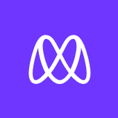

  
   

  <h3><b>Conference Site Readme</b></h3>

# 📗 Table of Contents

- [📖 About the Project](#about-project)
  - [🛠 Built With](#built-with)
    - [Tech Stack](#tech-stack)
    - [Key Features](#key-features)
  - [🚀 Live Demo](#live-demo)
- [💻 Getting Started](#getting-started)
  - [Setup](#setup)
  - [Prerequisites](#prerequisites)
  - [Install](#install)
  - [Usage](#usage)
  - [Run tests](#run-tests)
  - [Deployment](#triangular_flag_on_post-deployment)
- [👥 Authors](#authors)
- [🔭 Future Features](#future-features)
- [🤝 Contributing](#contributing)
- [⭐️ Show your support](#support)
- [🙏 Acknowledgements](#acknowledgements)
- [❓ FAQ](#faq)
- [📝 License](#license)

# 📖 Conference site 

**Conference Site** is a project that immitates the website of creative commons 2015 conference.

## 🛠 Built With 

### Tech Stack 

  
Client

  <ul>
    <li>HTML</li>
    <li>CSS</li>
    <li>JS</li>
  </ul>

### Key Features 

- **[Home Page]**
- **[About Page]**

(<a href="#readme-top">back to top</a>)

## 🚀 Live Demo 

- [Live Demo Link](https://dazehinn.github.io/personal-portfolio/)

(<a href="#readme-top">back to top</a>)

## 💻 Getting Started 

To get a local copy up and running, follow these steps.

### Prerequisites

In order to run this project you need:

- git
- web browser

### Setup

Clone this repository to your desired folder:

### Usage

To run the project, open the index.html file using a web browser

### Deployment

You can deploy this project using Github pages

(<a href="#readme-top">back to top</a>)

## 👥 Authors 

👤 **Nshanji Hilary Ndzi**

- GitHub: [@dazehinn](https://github.com/dazehinn)
- Twitter: [@HilaryNdzi](https://twitter.com/HilaryNdzi)
- LinkedIn: [LinkedIn](https://www.linkedin.com/in/nshanji-hilary-ndzi-b3b8a1256/)

(<a href="#readme-top">back to top</a>)

## 🔭 Future Features 

> Describe 1 - 3 features you will add to the project.

- [ ] **[Program page]**
- [ ] **[Sponsor Page]**

(<a href="#readme-top">back to top</a>)

## 🤝 Contributing 

Contributions, issues, and feature requests are welcome!

Feel free to check the [issues page](../../issues/).

(<a href="#readme-top">back to top</a>)

## ⭐️ Show your support 

If you like this project follow me on GitHub, twitter and LinkedIn

(<a href="#readme-top">back to top</a>)

## 🙏 Acknowledgments 

I would like to thank my coding partners and standup team for their encouragements
Special thanks go to (Ciny Shin)[https://www.behance.net/adagio07] for her design in Behance

(<a href="#readme-top">back to top</a>)

## 📝 License 

This project is [MIT](./LICENSE) licensed.

(<a href="#readme-top">back to top</a>)

